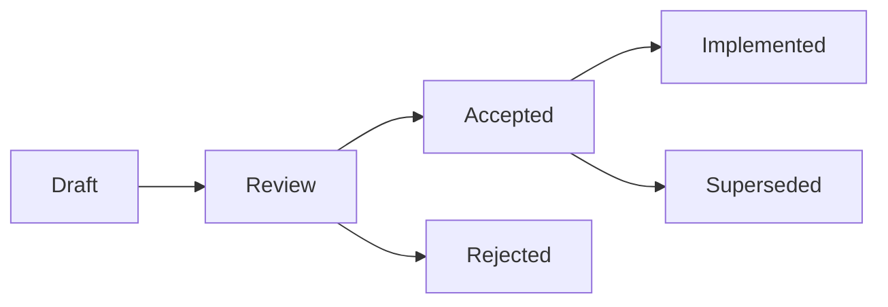

# ECommerce Platform RFCs (Request for Comments)

Bu dizin ECommerce platformu için teknik karar alma süreçlerini ve mimari önerileri içeren RFC'leri (Request for Comments) barındırır.

## RFC Süreci

### RFC Nedir?
RFC (Request for Comments), büyük teknik değişiklikler, yeni özellikler veya mimari kararlar için kullanılan bir dokümantasyon ve karar alma sürecidir. RFC'ler şeffaf bir şekilde teknik kararların alınmasını ve ekip içi bilgi paylaşımını sağlar.

### RFC Yaşam Döngüsü



#### RFC Durumları:
- **Draft**: İlk taslak, henüz incelenmemiş
- **Review**: Ekip tarafından inceleniyor
- **Accepted**: Kabul edildi, implementasyona hazır
- **Rejected**: Reddedildi, gerekçeleri belirtilmiş
- **Implemented**: Başarıyla implement edildi
- **Superseded**: Daha yeni bir RFC tarafından geçersiz kılındı

## Mevcut RFC'ler

### 🔄 [RFC-001: API Versioning Strategy](./RFC-001-API-Versioning-Strategy.md)
**Durum**: Draft | **Tarih**: 2024-12-28

API versiyonlama stratejisi ile backward compatibility ve maintainable API evolution.

**Ana Konular**:
- Semantic versioning (SemVer) kullanımı
- URL path versioning stratejisi
- Deprecation ve sunset politikaları
- Client SDK desteği

---

### 🎯 [RFC-002: Event-Driven Architecture](./RFC-002-Event-Driven-Architecture.md)
**Durum**: Draft | **Tarih**: 2024-12-28

Event-driven architecture implementasyonu ile sistem decoupling ve real-time capabilities.

**Ana Konular**:
- Domain events ve integration events
- Saga pattern ile distributed transactions
- Event sourcing ve audit trails
- Transactional outbox pattern

---

### 🏗️ [RFC-003: Microservice Migration Strategy](./RFC-003-Microservice-Migration-Strategy.md)
**Durum**: Draft | **Tarih**: 2024-12-28

Monolithic'den microservices'e geçiş için kapsamlı strateji ve implementation planı.

**Ana Konular**:
- Strangler fig pattern ile gradual migration
- Service boundaries definition
- Database-per-service pattern
- API Gateway ve service discovery

---

### ⚡ [RFC-004: Performance Optimization](./RFC-004-Performance-Optimization.md)
**Durum**: Draft | **Tarih**: 2024-12-28

Sub-200ms response times ve 10K+ concurrent users için performance optimization.

**Ana Konular**:
- Database query optimization
- Multi-level caching strategy
- Memory ve resource optimization
- Performance monitoring ve alerting

---

### 🔒 [RFC-005: Security Enhancement](./RFC-005-Security-Enhancement.md)
**Durum**: Draft | **Tarih**: 2024-12-28

Defense-in-depth principles ile kapsamlı security enhancement ve compliance.

**Ana Konular**:
- Multi-factor authentication (MFA)
- Data encryption at rest ve in transit
- Rate limiting ve DDoS protection
- GDPR ve PCI DSS compliance

## RFC Yazma Rehberi

### RFC Template
Yeni bir RFC yazarken aşağıdaki template'i kullanın:

```markdown
# RFC-XXX: [Title]

**Author**: [Your Name]
**Status**: Draft
**Created**: [Date]

## Summary
## Motivation  
## Detailed Design
## Implementation Plan
## Risks and Mitigation
## Success Metrics
```

### RFC Yazarken Dikkat Edilecekler

1. **Açık ve Anlaşılır Ol**: Teknik detayları açık bir şekilde açıkla
2. **Alternatifleri Değerlendir**: Neden bu yaklaşımı seçtiğini belirt
3. **Risk Analizi Yap**: Potansiyel riskleri ve çözümlerini dahil et
4. **Implementation Plan**: Adım adım uygulama planı hazırla
5. **Success Metrics**: Başarıyı nasıl ölçeceğini belirt

### Code Examples
RFC'lerde kod örnekleri kullanırken:

```csharp
// İyi: Anlaşılır ve açıklayıcı örnek
public sealed class ProductService : IProductService
{
    private readonly IProductRepository _repository;
    private readonly ICacheService _cache;

    public async Task<Product> GetProductAsync(Guid id)
    {
        var cacheKey = $"product:{id}";
        var cachedProduct = await _cache.GetAsync<Product>(cacheKey);
        
        if (cachedProduct != null)
            return cachedProduct;

        var product = await _repository.GetByIdAsync(id);
        await _cache.SetAsync(cacheKey, product, TimeSpan.FromMinutes(30));
        
        return product;
    }
}
```

## RFC Review Süreci

### 1. RFC Oluşturma
- Yeni bir RFC dosyası oluştur
- RFC numarasını sıradaki sayı olarak ata
- Template'i kullanarak içeriği doldur

### 2. Initial Review
- Pull request oluştur
- En az 2 senior developer'dan review al
- Technical lead approval'ı gerekli

### 3. Team Discussion
- Weekly tech meeting'de tartışılır
- Feedback'ler RFC'ye entegre edilir
- Gerekirse proof of concept implementasyonu yapılır

### 4. Final Decision
- Tech lead ve product owner tarafından final karar verilir
- Status güncellenir (Accepted/Rejected)
- Implementation timeline belirlenir

## RFC İmplementasyon Takibi

### Accepted RFC'ler için:
- [ ] **RFC-001**: API Versioning - Implementation pending
- [ ] **RFC-002**: Event-Driven Architecture - Implementation pending  
- [ ] **RFC-003**: Microservice Migration - Implementation pending
- [ ] **RFC-004**: Performance Optimization - Implementation pending
- [ ] **RFC-005**: Security Enhancement - Implementation pending

### Implementation Checklist Template:

```markdown
## RFC-XXX Implementation Checklist

### Phase 1: Foundation
- [ ] Task 1
- [ ] Task 2
- [ ] Task 3

### Phase 2: Core Implementation  
- [ ] Task 1
- [ ] Task 2

### Phase 3: Testing & Validation
- [ ] Task 1
- [ ] Task 2

### Phase 4: Deployment & Monitoring
- [ ] Task 1
- [ ] Task 2
```

## Best Practices

### RFC Yazarken:
- ✅ Problemi net bir şekilde tanımla
- ✅ Önerilen çözümü detaylandır
- ✅ Alternatifleri değerlendir
- ✅ Risk analizi yap
- ✅ Implementation timeline'ı belirle
- ✅ Success metrics tanımla

### RFC Review Yaparken:
- ✅ Teknik doğruluğu kontrol et
- ✅ Performance implications'ı değerlendir
- ✅ Security concerns'leri gözden geçir
- ✅ Maintainability'yi düşün
- ✅ Alternative approaches'ı sorgula

### RFC Implementation:
- ✅ Implementation plan'ı takip et
- ✅ Regular progress updates yap
- ✅ Testing strategy'yi uygula
- ✅ Documentation'ı güncelle
- ✅ Success metrics'leri ölç

## Kaynaklar

- [Rust RFC Process](https://github.com/rust-lang/rfcs)
- [Python PEP Process](https://www.python.org/dev/peps/)
- [IETF RFC Process](https://www.ietf.org/standards/rfcs/)

## İletişim

RFC'ler hakkında sorularınız için:
- **Slack**: #tech-rfcs kanalı
- **Email**: tech-lead@company.com
- **Weekly Meeting**: Her Çarşamba 14:00 Tech Review Meeting

---

**Son Güncelleme**: 2024-12-28  
**Maintainer**: Development Team 