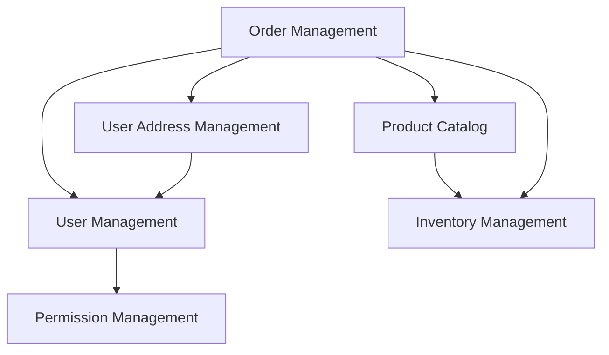

# RFC-003: Microservice Migration Strategy

**Author**: Development Team  
**Status**: Draft  
**Created**: 2024-12-28  
**Updated**: 2024-12-28  

## Summary

This RFC outlines a comprehensive strategy for migrating the monolithic ECommerce platform to a microservices architecture, ensuring minimal disruption to existing functionality while enabling scalability and team autonomy.

## Motivation

### Current Challenges with Monolithic Architecture
- **Scalability Bottlenecks**: Cannot scale individual components independently
- **Technology Lock-in**: Entire application tied to .NET stack
- **Team Dependencies**: Multiple teams working on same codebase creates conflicts
- **Deployment Risks**: Single point of failure affects entire system
- **Resource Utilization**: Inefficient resource allocation for different workloads

### Benefits of Microservices Migration
- **Independent Scaling**: Scale services based on demand
- **Technology Diversity**: Choose best technology for each service
- **Team Autonomy**: Independent development and deployment cycles
- **Fault Isolation**: Service failures don't bring down entire system
- **Faster Time-to-Market**: Parallel development and deployment

## Current Architecture Analysis

### Existing Bounded Contexts
Based on the current codebase, we've identified the following bounded contexts:

```
ECommerce Monolith
├── User Management (Identity & Authentication)
├── Product Catalog (Products & Categories)
├── Order Management (Orders & OrderItems)
├── Inventory Management (Stock & Reservations)
├── User Address Management
└── Permission & Role Management
```

### Dependencies Analysis


## Detailed Design

### 1. Migration Strategy: Strangler Fig Pattern

We'll use the Strangler Fig pattern to gradually replace monolithic components with microservices.

#### Phase 1: Extract Independent Services
**Target Services (Low Risk)**:
1. **Notification Service** - Email, SMS notifications
2. **Audit Service** - Logging and audit trails
3. **File Storage Service** - Product images, documents

#### Phase 2: Extract Core Business Services
**Target Services (Medium Risk)**:
4. **Product Catalog Service** - Products and categories
5. **Inventory Service** - Stock management
6. **User Address Service** - Address management

#### Phase 3: Extract Complex Services
**Target Services (High Risk)**:
7. **User Management Service** - Users, authentication
8. **Order Management Service** - Orders and order processing
9. **Permission Service** - Authorization and permissions

### 2. Service Boundaries Definition

#### User Management Service
```yaml
Responsibilities:
  - User registration and authentication
  - User profile management
  - Password management
  - User sessions

Database:
  - Users table
  - User claims
  - User tokens

APIs:
  - POST /users/register
  - POST /users/login
  - GET /users/{id}
  - PUT /users/{id}
  - POST /users/password/reset
```

#### Product Catalog Service
```yaml
Responsibilities:
  - Product CRUD operations
  - Category management
  - Product search and filtering
  - Product recommendations

Database:
  - Products table
  - Categories table
  - Product search indexes

APIs:
  - GET /products
  - GET /products/{id}
  - POST /products
  - PUT /products/{id}
  - GET /categories
```

#### Order Management Service
```yaml
Responsibilities:
  - Order creation and management
  - Order status tracking
  - Order history
  - Shopping cart operations

Database:
  - Orders table
  - Order items table
  - Shopping cart table

APIs:
  - POST /orders
  - GET /orders/{id}
  - GET /orders/user/{userId}
  - PUT /orders/{id}/status
  - POST /cart/items
```

#### Inventory Service
```yaml
Responsibilities:
  - Stock level tracking
  - Stock reservations
  - Stock allocation
  - Inventory adjustments

Database:
  - Product stock table
  - Stock movements table
  - Reservations table

APIs:
  - GET /inventory/product/{productId}
  - POST /inventory/reserve
  - POST /inventory/release
  - PUT /inventory/adjust
```

### 3. Data Management Strategy

#### Database-per-Service Pattern
Each microservice will have its own database to ensure loose coupling:

```yaml
Services:
  user-service:
    database: users_db
    type: PostgreSQL
    
  product-service:
    database: products_db
    type: PostgreSQL
    search_engine: Elasticsearch
    
  order-service:
    database: orders_db
    type: PostgreSQL
    
  inventory-service:
    database: inventory_db
    type: PostgreSQL
    cache: Redis
    
  notification-service:
    database: notifications_db
    type: PostgreSQL
    message_queue: RabbitMQ
```

#### Data Consistency Patterns

**Saga Pattern for Distributed Transactions**:
```csharp
public class OrderProcessingSaga
{
    // Step 1: Create Order
    public async Task CreateOrder(CreateOrderCommand command)
    {
        var order = await _orderService.CreateOrderAsync(command);
        await _eventBus.PublishAsync(new OrderCreatedEvent(order.Id));
    }
    
    // Step 2: Reserve Inventory
    public async Task Handle(OrderCreatedEvent @event)
    {
        var result = await _inventoryService.ReserveStockAsync(@event.OrderId, @event.Items);
        if (result.IsSuccess)
        {
            await _eventBus.PublishAsync(new InventoryReservedEvent(@event.OrderId));
        }
        else
        {
            await _eventBus.PublishAsync(new OrderFailedEvent(@event.OrderId, "Insufficient stock"));
        }
    }
    
    // Step 3: Process Payment
    public async Task Handle(InventoryReservedEvent @event)
    {
        var result = await _paymentService.ProcessPaymentAsync(@event.OrderId);
        if (result.IsSuccess)
        {
            await _eventBus.PublishAsync(new PaymentProcessedEvent(@event.OrderId));
        }
        else
        {
            // Compensating action: Release inventory
            await _inventoryService.ReleaseStockAsync(@event.OrderId);
            await _eventBus.PublishAsync(new OrderFailedEvent(@event.OrderId, "Payment failed"));
        }
    }
}
```

**Event Sourcing for Audit Trail**:
```csharp
public class OrderAggregateRoot : AggregateRoot
{
    public void Apply(OrderCreatedEvent @event)
    {
        Id = @event.OrderId;
        UserId = @event.UserId;
        Status = OrderStatus.Pending;
        // ... other properties
    }
    
    public void Apply(OrderStatusChangedEvent @event)
    {
        Status = @event.NewStatus;
        LastModified = @event.Timestamp;
    }
}
```

### 4. Communication Patterns

#### Synchronous Communication (REST APIs)
For real-time operations with immediate consistency requirements:

```csharp
// Product service client
public class ProductServiceClient
{
    private readonly HttpClient _httpClient;
    
    public async Task<ProductDto> GetProductAsync(Guid productId)
    {
        var response = await _httpClient.GetAsync($"/products/{productId}");
        return await response.Content.ReadFromJsonAsync<ProductDto>();
    }
}

// Circuit breaker pattern
public class CircuitBreakerProductService : IProductService
{
    private readonly IProductService _productService;
    private readonly ICircuitBreaker _circuitBreaker;
    
    public async Task<Product> GetProductAsync(Guid id)
    {
        return await _circuitBreaker.ExecuteAsync(async () =>
        {
            return await _productService.GetProductAsync(id);
        });
    }
}
```

#### Asynchronous Communication (Event Bus)
For eventual consistency and decoupled operations:

```csharp
// Event bus interface
public interface IEventBus
{
    Task PublishAsync<T>(T @event) where T : IIntegrationEvent;
    void Subscribe<T, THandler>() 
        where T : IIntegrationEvent
        where THandler : IIntegrationEventHandler<T>;
}

// Integration event
public record ProductPriceChangedEvent(
    Guid ProductId,
    decimal OldPrice,
    decimal NewPrice,
    DateTime ChangedAt
) : IIntegrationEvent;

// Event handler in order service
public class ProductPriceChangedEventHandler : IIntegrationEventHandler<ProductPriceChangedEvent>
{
    public async Task Handle(ProductPriceChangedEvent @event)
    {
        // Update cached product prices in order service
        await _productCacheService.UpdatePriceAsync(@event.ProductId, @event.NewPrice);
    }
}
```

### 5. Service Discovery and Load Balancing

#### Service Registry Pattern
```yaml
# Docker Compose with Consul
version: '3.8'
services:
  consul:
    image: consul:latest
    ports:
      - "8500:8500"
      
  user-service:
    image: ecommerce/user-service:latest
    environment:
      - CONSUL_HOST=consul
      - SERVICE_NAME=user-service
      - SERVICE_PORT=80
    depends_on:
      - consul
      
  product-service:
    image: ecommerce/product-service:latest
    environment:
      - CONSUL_HOST=consul
      - SERVICE_NAME=product-service
      - SERVICE_PORT=80
    depends_on:
      - consul
```

#### API Gateway Pattern
```csharp
// Ocelot configuration
{
  "Routes": [
    {
      "DownstreamPathTemplate": "/api/products/{everything}",
      "DownstreamScheme": "http",
      "ServiceName": "product-service",
      "LoadBalancerOptions": {
        "Type": "RoundRobin"
      },
      "UpstreamPathTemplate": "/api/products/{everything}",
      "UpstreamHttpMethod": [ "GET", "POST", "PUT", "DELETE" ]
    },
    {
      "DownstreamPathTemplate": "/api/orders/{everything}",
      "DownstreamScheme": "http",
      "ServiceName": "order-service",
      "LoadBalancerOptions": {
        "Type": "RoundRobin"
      },
      "UpstreamPathTemplate": "/api/orders/{everything}",
      "UpstreamHttpMethod": [ "GET", "POST", "PUT", "DELETE" ]
    }
  ],
  "GlobalConfiguration": {
    "ServiceDiscoveryProvider": {
      "Host": "consul",
      "Port": 8500,
      "Type": "Consul"
    }
  }
}
```

### 6. Security Strategy

#### JWT Token Validation Across Services
```csharp
// Shared JWT validation middleware
public class JwtValidationMiddleware
{
    public async Task InvokeAsync(HttpContext context, RequestDelegate next)
    {
        var token = ExtractTokenFromHeader(context.Request);
        
        if (token != null)
        {
            var principal = await ValidateTokenAsync(token);
            context.User = principal;
        }
        
        await next(context);
    }
    
    private async Task<ClaimsPrincipal> ValidateTokenAsync(string token)
    {
        // Validate token against auth service or shared key
        var handler = new JwtSecurityTokenHandler();
        var validationParameters = new TokenValidationParameters
        {
            ValidateIssuer = true,
            ValidIssuer = "https://auth.ecommerce.com",
            ValidateAudience = true,
            ValidAudiences = new[] { "api" },
            ValidateIssuerSigningKey = true,
            IssuerSigningKey = GetSigningKey()
        };
        
        var result = await handler.ValidateTokenAsync(token, validationParameters);
        return new ClaimsPrincipal(result.ClaimsIdentity);
    }
}
```

#### Service-to-Service Authentication
```csharp
// Client credentials flow for service-to-service calls
public class ServiceAuthenticationHandler : DelegatingHandler
{
    private readonly ITokenService _tokenService;
    
    protected override async Task<HttpResponseMessage> SendAsync(
        HttpRequestMessage request, 
        CancellationToken cancellationToken)
    {
        var token = await _tokenService.GetServiceTokenAsync();
        request.Headers.Authorization = new AuthenticationHeaderValue("Bearer", token);
        
        return await base.SendAsync(request, cancellationToken);
    }
}
```

### 7. Monitoring and Observability

#### Distributed Tracing
```csharp
// OpenTelemetry configuration
services.AddOpenTelemetry()
    .WithTracing(builder =>
    {
        builder
            .AddAspNetCoreInstrumentation()
            .AddHttpClientInstrumentation()
            .AddEntityFrameworkCoreInstrumentation()
            .AddJaegerExporter();
    });

// Custom activity source
public class OrderService
{
    private static readonly ActivitySource ActivitySource = new("ECommerce.OrderService");
    
    public async Task<Order> CreateOrderAsync(CreateOrderCommand command)
    {
        using var activity = ActivitySource.StartActivity("CreateOrder");
        activity?.SetTag("order.userId", command.UserId.ToString());
        activity?.SetTag("order.itemCount", command.Items.Count.ToString());
        
        // Business logic
        var order = new Order(command.UserId, command.Items);
        
        activity?.SetTag("order.id", order.Id.ToString());
        return order;
    }
}
```

#### Centralized Logging
```yaml
# ELK Stack configuration
version: '3.8'
services:
  elasticsearch:
    image: docker.elastic.co/elasticsearch/elasticsearch:7.14.0
    
  logstash:
    image: docker.elastic.co/logstash/logstash:7.14.0
    
  kibana:
    image: docker.elastic.co/kibana/kibana:7.14.0
    ports:
      - "5601:5601"
      
  filebeat:
    image: docker.elastic.co/beats/filebeat:7.14.0
    volumes:
      - /var/log:/var/log:ro
```

### 8. Testing Strategy

#### Contract Testing
```csharp
// Pact consumer test
[Fact]
public async Task GetProduct_ReturnsProduct()
{
    var productId = Guid.NewGuid();
    
    _pactBuilder
        .UponReceiving("A request for a product")
        .Given($"Product {productId} exists")
        .WithRequest(HttpMethod.Get, $"/api/products/{productId}")
        .WillRespondWith(status: HttpStatusCode.OK)
        .WithJsonBody(new
        {
            id = productId,
            name = "Test Product",
            price = 29.99
        });

    var result = await _productService.GetProductAsync(productId);
    
    result.Should().NotBeNull();
    result.Id.Should().Be(productId);
}
```

#### Integration Testing
```csharp
// Service integration test
public class OrderServiceIntegrationTests : IClassFixture<CustomWebApplicationFactory>
{
    [Fact]
    public async Task CreateOrder_WithValidData_ReturnsOrderId()
    {
        // Arrange
        var client = _factory.CreateClient();
        var command = new CreateOrderCommand
        {
            UserId = Guid.NewGuid(),
            Items = new[] { new OrderItemDto { ProductId = Guid.NewGuid(), Quantity = 2 } }
        };

        // Act
        var response = await client.PostAsJsonAsync("/api/orders", command);

        // Assert
        response.StatusCode.Should().Be(HttpStatusCode.Created);
        var orderId = await response.Content.ReadFromJsonAsync<Guid>();
        orderId.Should().NotBeEmpty();
    }
}
```

## Implementation Plan

### Phase 1: Infrastructure Setup (Months 1-2)
- [ ] Set up CI/CD pipelines for microservices
- [ ] Implement service discovery (Consul)
- [ ] Set up API Gateway (Ocelot)
- [ ] Configure monitoring and logging infrastructure
- [ ] Implement shared libraries and contracts

### Phase 2: Extract Simple Services (Months 3-4)
- [ ] Extract Notification Service
- [ ] Extract Audit Service
- [ ] Extract File Storage Service
- [ ] Implement event bus with RabbitMQ
- [ ] Set up integration testing framework

### Phase 3: Extract Core Services (Months 5-7)
- [ ] Extract Product Catalog Service
- [ ] Extract Inventory Service
- [ ] Extract User Address Service
- [ ] Implement saga patterns for distributed transactions
- [ ] Performance testing and optimization

### Phase 4: Extract Complex Services (Months 8-10)
- [ ] Extract User Management Service
- [ ] Extract Order Management Service
- [ ] Extract Permission Service
- [ ] Implement circuit breakers and resilience patterns
- [ ] Security audit and penetration testing

### Phase 5: Optimization and Cleanup (Months 11-12)
- [ ] Remove monolithic components
- [ ] Optimize service boundaries
- [ ] Performance tuning
- [ ] Documentation and training
- [ ] Go-live preparation

## Migration Strategies

### Database Migration
```sql
-- Step 1: Create separate databases
CREATE DATABASE users_db;
CREATE DATABASE products_db;
CREATE DATABASE orders_db;
CREATE DATABASE inventory_db;

-- Step 2: Data migration scripts
INSERT INTO products_db.products 
SELECT id, name, description, price, category_id, created_at, updated_at
FROM monolith_db.products;

-- Step 3: Set up data synchronization
-- Use Change Data Capture (CDC) during transition period
```

### API Migration (Parallel Run)
```csharp
// Facade pattern for gradual migration
public class ProductApiFacade : IProductService
{
    private readonly IMonolithProductService _monolithService;
    private readonly IMicroserviceProductService _microserviceService;
    private readonly IFeatureToggleService _featureToggle;

    public async Task<Product> GetProductAsync(Guid id)
    {
        if (await _featureToggle.IsEnabledAsync("UseProductMicroservice"))
        {
            return await _microserviceService.GetProductAsync(id);
        }
        
        return await _monolithService.GetProductAsync(id);
    }
}
```

## Risks and Mitigation

### Risk: Data Consistency Issues
**Mitigation**: 
- Implement eventual consistency patterns
- Use saga pattern for distributed transactions
- Comprehensive integration testing

### Risk: Increased Complexity
**Mitigation**:
- Gradual migration approach
- Comprehensive monitoring and alerting
- Team training and documentation

### Risk: Performance Degradation
**Mitigation**:
- Load testing at each phase
- Caching strategies
- Circuit breaker patterns

### Risk: Service Discovery Failures
**Mitigation**:
- Multiple service registry instances
- Fallback mechanisms
- Health checks and auto-scaling

## Success Metrics

### Technical Metrics
- Service independence: 95% of features can be developed without cross-service changes
- Deployment frequency: Daily deployments per service
- Mean time to recovery: < 30 minutes
- Service availability: 99.9% uptime per service

### Business Metrics
- Feature delivery speed: 50% faster time-to-market
- Team productivity: Independent team deployment cycles
- Scalability: Individual service scaling based on demand
- Cost optimization: 30% reduction in infrastructure costs

## Future Considerations

- **Event Sourcing**: Complete audit trail and replay capabilities
- **CQRS**: Separate read and write models for complex queries
- **Kubernetes**: Container orchestration for production deployment
- **Service Mesh**: Advanced traffic management and security
- **GraphQL Federation**: Unified API layer across microservices

---

**Next Steps**:
1. Technical feasibility analysis for each service extraction
2. Team training on microservices patterns
3. Infrastructure setup and proof of concept
4. Detailed migration timeline and resource allocation 