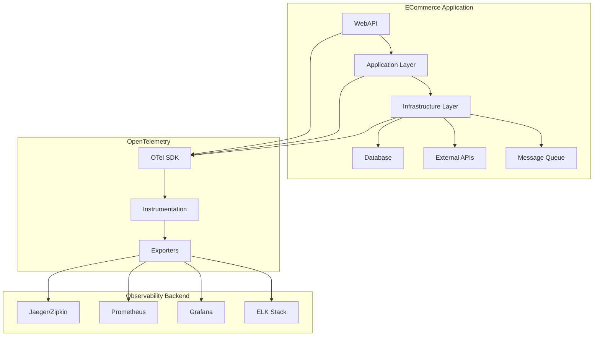

# RFC-005: Observability Strategy with OpenTelemetry

**Author**: Development Team  
**Status**: Draft  
**Created**: 2024-12-28  
**Updated**: 2024-12-28  

## Summary

This RFC proposes implementing a comprehensive observability strategy using OpenTelemetry to provide distributed tracing, metrics collection, and structured logging across the ECommerce platform. This will enable better monitoring, debugging, and performance optimization of our microservices architecture.

## Motivation

As our ECommerce platform evolves towards a microservices architecture, we need robust observability to:
- Track requests across multiple services and components
- Monitor application performance and identify bottlenecks
- Collect and analyze business and technical metrics
- Provide structured logging with correlation IDs
- Enable proactive monitoring and alerting
- Support debugging in distributed environments
- Comply with production monitoring requirements

## Detailed Design

### 1. OpenTelemetry Implementation

#### 1.1 Core Components

**Traces**: Distributed request tracing across services
- HTTP requests and responses
- Database operations
- External API calls
- Message queue operations
- Background job processing

**Metrics**: Application and business metrics
- Request rates and latencies
- Error rates and counts
- Business KPIs (orders, revenue, user actions)
- System metrics (CPU, memory, database connections)
- Custom application metrics

**Logs**: Structured logging with correlation
- Application logs with trace correlation
- Audit logs for security events
- Business event logs
- Error and exception logging

#### 1.2 Architecture Overview



### 2. Implementation Strategy

#### 2.1 NuGet Packages

```xml
<PackageReference Include="OpenTelemetry" Version="1.7.0" />
<PackageReference Include="OpenTelemetry.Extensions.Hosting" Version="1.7.0" />
<PackageReference Include="OpenTelemetry.Instrumentation.AspNetCore" Version="1.7.1" />
<PackageReference Include="OpenTelemetry.Instrumentation.Http" Version="1.7.1" />
<PackageReference Include="OpenTelemetry.Instrumentation.EntityFrameworkCore" Version="1.0.0-beta.8" />
<PackageReference Include="OpenTelemetry.Instrumentation.SqlClient" Version="1.7.0-beta.1" />
<PackageReference Include="OpenTelemetry.Exporter.Jaeger" Version="1.5.1" />
<PackageReference Include="OpenTelemetry.Exporter.Prometheus.AspNetCore" Version="1.7.0-alpha.1" />
<PackageReference Include="OpenTelemetry.Exporter.OpenTelemetryProtocol" Version="1.7.0" />
```

#### 2.2 Service Configuration

```csharp
// ECommerce.Infrastructure/DependencyInjection.cs
public static class DependencyInjection
{
    public static IServiceCollection AddObservability(
        this IServiceCollection services, 
        IConfiguration configuration)
    {
        var serviceName = "ECommerce.WebAPI";
        var serviceVersion = "1.0.0";

        services.AddOpenTelemetry()
            .ConfigureResource(resource => resource
                .AddService(serviceName, serviceVersion)
                .AddAttributes(new Dictionary<string, object>
                {
                    ["deployment.environment"] = configuration["Environment"] ?? "unknown",
                    ["service.instance.id"] = Environment.MachineName
                }))
            .WithTracing(tracerProviderBuilder =>
            {
                tracerProviderBuilder
                    .AddAspNetCoreInstrumentation(options =>
                    {
                        options.RecordException = true;
                        options.Filter = FilterRequests;
                        options.EnrichWithHttpRequest = EnrichWithHttpRequest;
                        options.EnrichWithHttpResponse = EnrichWithHttpResponse;
                    })
                    .AddHttpClientInstrumentation(options =>
                    {
                        options.RecordException = true;
                        options.FilterHttpRequestMessage = FilterHttpRequests;
                    })
                    .AddEntityFrameworkCoreInstrumentation(options =>
                    {
                        options.SetDbStatementForText = true;
                        options.SetDbStatementForStoredProcedure = true;
                        options.EnrichWithIDbCommand = EnrichWithDbCommand;
                    })
                    .AddSource("ECommerce.*")
                    .AddJaegerExporter(options =>
                    {
                        options.AgentHost = configuration["Jaeger:AgentHost"];
                        options.AgentPort = int.Parse(configuration["Jaeger:AgentPort"] ?? "6831");
                    })
                    .AddOtlpExporter(options =>
                    {
                        options.Endpoint = new Uri(configuration["OTLP:Endpoint"]);
                    });
            })
            .WithMetrics(meterProviderBuilder =>
            {
                meterProviderBuilder
                    .AddAspNetCoreInstrumentation()
                    .AddHttpClientInstrumentation()
                    .AddRuntimeInstrumentation()
                    .AddMeter("ECommerce.*")
                    .AddPrometheusExporter()
                    .AddOtlpExporter(options =>
                    {
                        options.Endpoint = new Uri(configuration["OTLP:Endpoint"]);
                    });
            });

        return services;
    }

    private static bool FilterRequests(HttpContext context)
    {
        // Filter out health checks and metrics endpoints
        var path = context.Request.Path.Value;
        return !path.StartsWith("/health") && 
               !path.StartsWith("/metrics") &&
               !path.StartsWith("/swagger");
    }

    private static void EnrichWithHttpRequest(Activity activity, HttpRequest request)
    {
        activity.SetTag("http.user_agent", request.Headers["User-Agent"].FirstOrDefault());
        activity.SetTag("http.client_ip", GetClientIpAddress(request));
        
        if (request.Headers.ContainsKey("X-Correlation-ID"))
        {
            activity.SetTag("correlation.id", request.Headers["X-Correlation-ID"].FirstOrDefault());
        }
    }

    private static void EnrichWithHttpResponse(Activity activity, HttpResponse response)
    {
        activity.SetTag("http.response.size", response.ContentLength);
    }
}
```

#### 2.3 Custom Instrumentation

```csharp
// ECommerce.Application/Instrumentation/ApplicationInstrumentation.cs
public static class ApplicationInstrumentation
{
    private static readonly ActivitySource ActivitySource = new("ECommerce.Application");
    private static readonly Meter Meter = new("ECommerce.Application");

    // Counters
    private static readonly Counter<long> OrdersCreatedCounter = 
        Meter.CreateCounter<long>("orders_created_total", "Total number of orders created");
    
    private static readonly Counter<long> PaymentProcessedCounter = 
        Meter.CreateCounter<long>("payments_processed_total", "Total number of payments processed");

    // Histograms
    private static readonly Histogram<double> OrderProcessingDuration = 
        Meter.CreateHistogram<double>("order_processing_duration", "seconds", "Time taken to process an order");

    // Gauges
    private static readonly ObservableGauge<int> ActiveUsersGauge = 
        Meter.CreateObservableGauge<int>("active_users", "Number of active users");

    public static Activity? StartActivity(string name, ActivityKind kind = ActivityKind.Internal)
    {
        return ActivitySource.StartActivity(name, kind);
    }

    public static void RecordOrderCreated(string orderStatus, decimal amount)
    {
        OrdersCreatedCounter.Add(1, new KeyValuePair<string, object?>("status", orderStatus));
        
        using var activity = StartActivity("order.created");
        activity?.SetTag("order.status", orderStatus);
        activity?.SetTag("order.amount", amount);
    }

    public static void RecordOrderProcessingTime(double durationSeconds, string orderType)
    {
        OrderProcessingDuration.Record(durationSeconds, 
            new KeyValuePair<string, object?>("order.type", orderType));
    }
}
```

#### 2.4 Repository Instrumentation

```csharp
// ECommerce.Persistence/Repositories/BaseRepository.cs
public abstract class BaseRepository<T> : IRepository<T> where T : BaseEntity
{
    private static readonly ActivitySource ActivitySource = new("ECommerce.Repository");
    protected readonly ApplicationDbContext _context;

    protected BaseRepository(ApplicationDbContext context)
    {
        _context = context;
    }

    public async Task<T?> GetByIdAsync(Guid id, CancellationToken cancellationToken = default)
    {
        using var activity = ActivitySource.StartActivity($"{typeof(T).Name}.GetById");
        activity?.SetTag("entity.id", id.ToString());
        activity?.SetTag("repository.operation", "GetById");

        try
        {
            var entity = await _context.Set<T>().FindAsync(new object[] { id }, cancellationToken);
            activity?.SetTag("entity.found", entity != null);
            return entity;
        }
        catch (Exception ex)
        {
            activity?.SetStatus(ActivityStatusCode.Error, ex.Message);
            activity?.RecordException(ex);
            throw;
        }
    }

    public async Task<T> AddAsync(T entity, CancellationToken cancellationToken = default)
    {
        using var activity = ActivitySource.StartActivity($"{typeof(T).Name}.Add");
        activity?.SetTag("repository.operation", "Add");

        try
        {
            _context.Set<T>().Add(entity);
            await _context.SaveChangesAsync(cancellationToken);
            activity?.SetTag("entity.id", entity.Id.ToString());
            return entity;
        }
        catch (Exception ex)
        {
            activity?.SetStatus(ActivityStatusCode.Error, ex.Message);
            activity?.RecordException(ex);
            throw;
        }
    }
}
```

#### 2.5 Command/Query Handler Instrumentation

```csharp
// ECommerce.Application/Behaviors/TracingBehavior.cs
public sealed class TracingBehavior<TRequest, TResponse> : IPipelineBehavior<TRequest, TResponse>
    where TRequest : notnull
{
    private static readonly ActivitySource ActivitySource = new("ECommerce.MediatR");

    public async Task<TResponse> Handle(
        TRequest request, 
        RequestHandlerDelegate<TResponse> next, 
        CancellationToken cancellationToken)
    {
        var requestName = typeof(TRequest).Name;
        using var activity = ActivitySource.StartActivity($"MediatR.{requestName}");
        
        activity?.SetTag("mediatr.request.type", typeof(TRequest).FullName);
        activity?.SetTag("mediatr.response.type", typeof(TResponse).FullName);

        try
        {
            var response = await next();
            activity?.SetStatus(ActivityStatusCode.Ok);
            return response;
        }
        catch (Exception ex)
        {
            activity?.SetStatus(ActivityStatusCode.Error, ex.Message);
            activity?.RecordException(ex);
            throw;
        }
    }
}
```

### 3. Logging Integration

#### 3.1 Structured Logging with Correlation

```csharp
// ECommerce.Infrastructure/Logging/SerilogLogger.cs
public sealed class SerilogLogger : ILogger
{
    private readonly Microsoft.Extensions.Logging.ILogger _logger;

    public SerilogLogger(Microsoft.Extensions.Logging.ILogger logger)
    {
        _logger = logger;
    }

    public void LogInformation(string message, params object[] args)
    {
        using var activity = Activity.Current;
        var correlationId = activity?.TraceId.ToString();
        var spanId = activity?.SpanId.ToString();

        _logger.LogInformation(message + " {TraceId} {SpanId}", 
            args.Concat(new object[] { correlationId, spanId }).ToArray());
    }

    public void LogError(Exception exception, string message, params object[] args)
    {
        using var activity = Activity.Current;
        activity?.RecordException(exception);
        
        _logger.LogError(exception, message + " {TraceId} {SpanId}", 
            args.Concat(new object[] { activity?.TraceId.ToString(), activity?.SpanId.ToString() }).ToArray());
    }
}
```

#### 3.2 Serilog Configuration

```json
{
  "Serilog": {
    "Using": ["Serilog.Sinks.Console", "Serilog.Sinks.File", "Serilog.Sinks.Seq"],
    "MinimumLevel": {
      "Default": "Information",
      "Override": {
        "Microsoft": "Warning",
        "System": "Warning",
        "Microsoft.EntityFrameworkCore": "Warning"
      }
    },
    "WriteTo": [
      {
        "Name": "Console",
        "Args": {
          "outputTemplate": "[{Timestamp:HH:mm:ss} {Level:u3}] {Message:lj} {TraceId} {SpanId} {NewLine}{Exception}"
        }
      },
      {
        "Name": "File",
        "Args": {
          "path": "logs/ecommerce-.log",
          "rollingInterval": "Day",
          "outputTemplate": "[{Timestamp:yyyy-MM-dd HH:mm:ss.fff zzz} {Level:u3}] {Message:lj} {TraceId} {SpanId} {NewLine}{Exception}"
        }
      },
      {
        "Name": "Seq",
        "Args": {
          "serverUrl": "http://localhost:5341"
        }
      }
    ],
    "Enrich": ["FromLogContext", "WithMachineName", "WithThreadId"]
  }
}
```

### 4. Metrics and KPIs

#### 4.1 Business Metrics

```csharp
// ECommerce.Application/Metrics/BusinessMetrics.cs
public sealed class BusinessMetrics
{
    private static readonly Meter Meter = new("ECommerce.Business");

    // Order Metrics
    private static readonly Counter<long> OrdersCounter = 
        Meter.CreateCounter<long>("orders_total", "Total number of orders");
    
    private static readonly Histogram<double> OrderValueHistogram = 
        Meter.CreateHistogram<double>("order_value", "currency", "Order value distribution");

    // Product Metrics
    private static readonly Counter<long> ProductViewsCounter = 
        Meter.CreateCounter<long>("product_views_total", "Total product views");

    // User Metrics
    private static readonly Counter<long> UserRegistrationsCounter = 
        Meter.CreateCounter<long>("user_registrations_total", "Total user registrations");

    public static void RecordOrder(decimal value, string status, string paymentMethod)
    {
        OrdersCounter.Add(1, 
            new KeyValuePair<string, object?>("status", status),
            new KeyValuePair<string, object?>("payment_method", paymentMethod));
        
        OrderValueHistogram.Record((double)value,
            new KeyValuePair<string, object?>("status", status));
    }

    public static void RecordProductView(string categoryName, string productId)
    {
        ProductViewsCounter.Add(1,
            new KeyValuePair<string, object?>("category", categoryName),
            new KeyValuePair<string, object?>("product_id", productId));
    }
}
```

#### 4.2 Technical Metrics

```csharp
// ECommerce.Application/Metrics/TechnicalMetrics.cs
public sealed class TechnicalMetrics
{
    private static readonly Meter Meter = new("ECommerce.Technical");

    // Database Metrics
    private static readonly Histogram<double> DatabaseQueryDuration = 
        Meter.CreateHistogram<double>("database_query_duration", "seconds", "Database query execution time");

    // Cache Metrics
    private static readonly Counter<long> CacheHitsCounter = 
        Meter.CreateCounter<long>("cache_hits_total", "Total cache hits");
    
    private static readonly Counter<long> CacheMissesCounter = 
        Meter.CreateCounter<long>("cache_misses_total", "Total cache misses");

    // API Metrics
    private static readonly Counter<long> ApiRequestsCounter = 
        Meter.CreateCounter<long>("api_requests_total", "Total API requests");

    public static void RecordDatabaseQuery(double durationSeconds, string operation, string table)
    {
        DatabaseQueryDuration.Record(durationSeconds,
            new KeyValuePair<string, object?>("operation", operation),
            new KeyValuePair<string, object?>("table", table));
    }

    public static void RecordCacheHit(string cacheKey)
    {
        CacheHitsCounter.Add(1,
            new KeyValuePair<string, object?>("cache_key", cacheKey));
    }

    public static void RecordCacheMiss(string cacheKey)
    {
        CacheMissesCounter.Add(1,
            new KeyValuePair<string, object?>("cache_key", cacheKey));
    }
}
```

### 5. Configuration

#### 5.1 appsettings.json

```json
{
  "OpenTelemetry": {
    "ServiceName": "ECommerce.WebAPI",
    "ServiceVersion": "1.0.0",
    "Jaeger": {
      "AgentHost": "localhost",
      "AgentPort": "6831",
      "Endpoint": "http://localhost:14268/api/traces"
    },
    "OTLP": {
      "Endpoint": "http://localhost:4317"
    },
    "Prometheus": {
      "Endpoint": "/metrics"
    }
  },
  "Seq": {
    "ServerUrl": "http://localhost:5341",
    "ApiKey": ""
  }
}
```

#### 5.2 Docker Compose for Development

```yaml
# compose.observability.yaml
version: '3.8'

services:
  jaeger:
    image: jaegertracing/all-in-one:latest
    ports:
      - "16686:16686"
      - "14268:14268"
      - "6831:6831/udp"
    environment:
      - COLLECTOR_OTLP_ENABLED=true

  prometheus:
    image: prom/prometheus:latest
    ports:
      - "9090:9090"
    volumes:
      - ./prometheus.yml:/etc/prometheus/prometheus.yml

  grafana:
    image: grafana/grafana:latest
    ports:
      - "3000:3000"
    environment:
      - GF_SECURITY_ADMIN_PASSWORD=admin
    volumes:
      - grafana-storage:/var/lib/grafana

  seq:
    image: datalust/seq:latest
    ports:
      - "5341:80"
    environment:
      - ACCEPT_EULA=Y

volumes:
  grafana-storage:
```

### 6. Dashboards and Alerting

#### 6.1 Grafana Dashboard Examples

**Application Overview Dashboard**:
- Request rate and latency percentiles
- Error rate trends
- Database query performance
- Cache hit/miss ratios
- Active user count

**Business Metrics Dashboard**:
- Orders per hour/day
- Revenue trends
- Product view analytics
- User registration metrics
- Conversion funnel

#### 6.2 Alerting Rules

```yaml
# prometheus-alerts.yml
groups:
  - name: ecommerce-alerts
    rules:
      - alert: HighErrorRate
        expr: rate(http_requests_total{status=~"5.."}[5m]) > 0.1
        for: 2m
        labels:
          severity: critical
        annotations:
          summary: "High error rate detected"
          description: "Error rate is {{ $value }} requests/second"

      - alert: HighLatency
        expr: histogram_quantile(0.95, rate(http_request_duration_seconds_bucket[5m])) > 1
        for: 5m
        labels:
          severity: warning
        annotations:
          summary: "High latency detected"
          description: "95th percentile latency is {{ $value }} seconds"

      - alert: DatabaseSlowQueries
        expr: histogram_quantile(0.95, rate(database_query_duration_bucket[5m])) > 5
        for: 3m
        labels:
          severity: warning
        annotations:
          summary: "Slow database queries detected"
```

### 7. Performance Impact

#### 7.1 Overhead Considerations

**Tracing Overhead**:
- ~1-5% CPU overhead with sampling
- ~1-2% memory overhead
- Minimal network impact with batching

**Metrics Overhead**:
- ~0.5-1% CPU overhead
- Minimal memory impact
- Efficient collection and export

#### 7.2 Sampling Strategies

```csharp
// Adaptive sampling based on load
services.Configure<TracingSamplerOptions>(options =>
{
    options.SamplingRatio = Environment.GetEnvironmentVariable("ASPNETCORE_ENVIRONMENT") == "Production" 
        ? 0.1 // 10% sampling in production
        : 1.0; // 100% sampling in development
});
```

### 8. Security and Privacy

#### 8.1 Data Sanitization

```csharp
public static void EnrichWithSanitizedRequest(Activity activity, HttpRequest request)
{
    // Don't log sensitive headers
    var sanitizedHeaders = request.Headers
        .Where(h => !SensitiveHeaders.Contains(h.Key.ToLowerInvariant()))
        .ToDictionary(h => h.Key, h => h.Value.ToString());
    
    activity.SetTag("http.request.headers", JsonSerializer.Serialize(sanitizedHeaders));
}

private static readonly HashSet<string> SensitiveHeaders = new()
{
    "authorization",
    "cookie",
    "x-api-key",
    "x-auth-token"
};
```

#### 8.2 PII Handling

- Exclude personal data from traces and metrics
- Use hashed user IDs for correlation
- Implement data retention policies
- Ensure compliance with GDPR/privacy regulations

### 9. Testing Strategy

#### 9.1 Integration Tests

```csharp
[Fact]
public async Task CreateOrder_ShouldGenerateTraceSpan()
{
    // Arrange
    using var tracerProvider = TracerProviderBuilder.Create()
        .AddSource("ECommerce.Application")
        .AddInMemoryExporter(exportedItems)
        .Build();

    // Act
    var response = await _client.PostAsync("/api/orders", content);

    // Assert
    Assert.True(exportedItems.Any(activity => 
        activity.DisplayName.Contains("CreateOrder")));
}
```

### 10. Migration Plan

#### Phase 1: Foundation (Week 1-2)
- Install OpenTelemetry packages
- Configure basic tracing for HTTP requests
- Set up Jaeger for development

#### Phase 2: Application Instrumentation (Week 3-4)
- Add custom spans for business operations
- Instrument repositories and services
- Configure metrics collection

#### Phase 3: Observability Backend (Week 5-6)
- Set up production monitoring stack
- Configure Grafana dashboards
- Implement alerting rules

#### Phase 4: Optimization (Week 7-8)
- Fine-tune sampling rates
- Optimize performance
- Add business-specific metrics

## Alternatives Considered

### Application Insights
**Pros**: Native Azure integration, automatic instrumentation
**Cons**: Vendor lock-in, limited customization, higher cost

### Elastic APM
**Pros**: Full ELK stack integration, powerful querying
**Cons**: Complex setup, resource intensive, licensing costs

### DataDog APM
**Pros**: Comprehensive monitoring, easy setup
**Cons**: High cost, vendor lock-in, limited on-premises options

## Implementation Timeline

- **Week 1**: Infrastructure setup and basic tracing
- **Week 2**: Repository and service instrumentation  
- **Week 3**: Custom metrics and business KPIs
- **Week 4**: Dashboard creation and alerting
- **Week 5**: Performance tuning and optimization
- **Week 6**: Documentation and team training

## Success Metrics

- **Technical**:
  - 95% of requests traced successfully
  - <2% performance overhead
  - <1 minute MTTR improvement

- **Business**:
  - 50% faster issue resolution
  - Improved SLA compliance
  - Better capacity planning accuracy

## Risks and Mitigation

### Performance Impact
**Risk**: Observability overhead affects application performance
**Mitigation**: Implement sampling, monitor overhead metrics, adjust configuration

### Data Volume
**Risk**: High telemetry data costs
**Mitigation**: Implement retention policies, use sampling, optimize data export

### Complexity
**Risk**: Increased operational complexity
**Mitigation**: Comprehensive documentation, team training, gradual rollout

## Conclusion

Implementing OpenTelemetry will provide comprehensive observability for our ECommerce platform, enabling better monitoring, debugging, and optimization. The proposed approach balances functionality with performance while maintaining flexibility for future requirements.

The phased implementation approach minimizes risk while delivering immediate value through improved visibility into application behavior and performance.